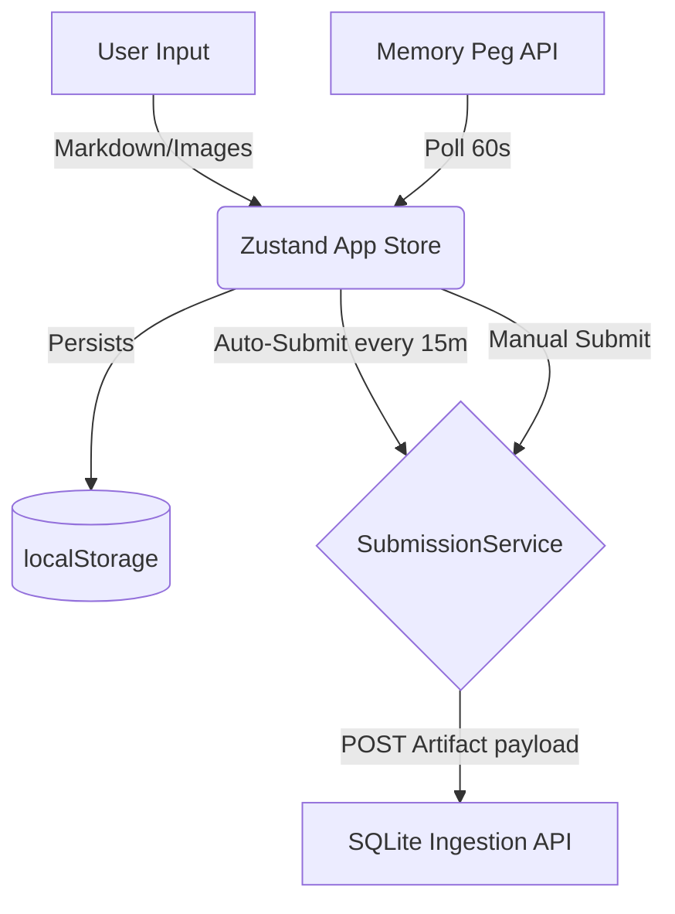

# L-Mnemo3 Frontend

The L-Mnemo3 Frontend serves as the primary "inbox" interface for continuous information capture.

## Rationale
The application allows the user to continuously collect information throughout the day. Every 15 minutes (a "quadrant"), the collected markdown and images are packaged as one RAW artifact and sent to an ingestion API.

## Goal
To provide a fast, responsive, markdown-supported editor that never loses data (via autosave) and seamlessly packages Memory Peg context with every submission.

## Main Features
- **3-Column Layout:** Sidebar for context, Center for editing, Right sidebar for stats and image preview.
- **Markdown Editor:** Native drag-and-drop for images, clipboard pasting, and markdown formatting.
- **Automatic Submission:** 15-minute quadrant countdown timer automatically packages and sends the artifact.
- **Memory Peg Polling:** Automatically queries the authoritative Memory Peg API every 60 seconds.
- **Data Persistence:** Autosaves the draft and images to `localStorage` to recover from browser crashes.

## Roadmap Features
- Authentication
- Multiple notebooks
- Search & SQLite browser
- Artifact history & Flashcards
- Review generation & Embeddings
- Semantic search & OCR
- Speech-to-text & Voice dictation

## Architecture Data Flow

