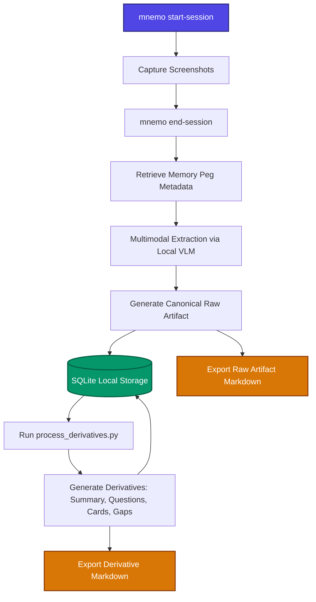

# L-Mnemo: Intelligent Learning Ingestion Pipeline

L-Mnemo is a state-of-the-art learning capture system designed to convert active study screenshots into structured, durable knowledge artifacts. Inspired by advanced ingestion workflows in frontier AI labs, it processes fragmented screenshots into coherent, annotated, and derivative-decorated study materials.

---

## 📖 Rationale & Goal
Modern learning occurs dynamically across multiple channels—Gemini/ChatGPT chat sessions, YouTube lectures, PDF whitepapers, and web-based documentation. Screenshots are the lowest-friction capture mechanism but are highly fragmented and lack structure. 

The goal of **L-Mnemo** is to ingest these screenshots, perform multimodal OCR/extraction using local VLMs (Vision-Language Models), group them into logical study sessions, and decorate them with contextual Memory Pegs. From there, it generates disposable, high-value learning derivatives (flashcards, summaries, and diagnostic review questions).

---

## 🛠️ Main Features (v1 Scope)
1. **Screenshot Grouping & Ingestion**: Organizes multiple session-based screenshots into unified logical blocks.
2. **Multimodal Extraction**: Invokes local VLMs (e.g., `qwen3-vl`) to perform OCR, transcribe diagrams, extract tables, format formulas, and capture educational intent.
3. **Memory Peg Decoration**: Ingests contextual metadata from the external Memory Peg API (weeks, days, quadrants, and character archetypes) to act as visual/spatial retrieval cues.
4. **SQLite Storage & Markdown Export**: Maintains local SQLite database integrity for structured queries while exporting clean Markdown for user review.
5. **Downstream Derivatives**: Generates summaries, diagnostic questions, active recall flashcards, and knowledge gap reports.

---

## 🔮 Roadmap Features
- **Mnemonic Scene Generation**: Combine extracted concepts with Memory Peg characters to build interactive visual memory scenes.
- **Flashcard Scheduling & Anki Integration**: Automate spaced-repetition sync.
- **RAG & Knowledge Graphs**: Allow semantic search over canonical raw artifacts.
- **Review Dashboard**: Provide a visual progress-tracking UI.

---

## 📊 Application Data Flow



---

## 🚀 Happy Path Development Command

```bash
docker compose up --build
```
*(For detail configuration and local orchestration, refer to `@Docs/Docker-Setup.md`)*
